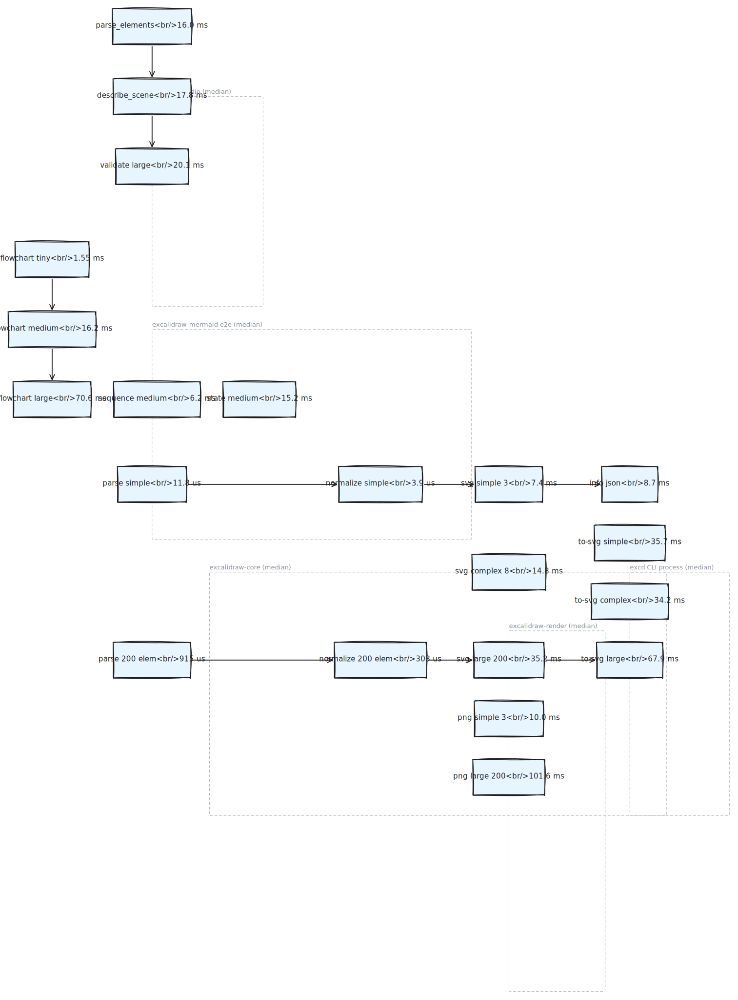

# Benchmarks

Criterion micro-benchmarks for the `excalidraw-native` workspace. Targets and
fail thresholds are advisory soft-warnings (see `benches/benchmark_targets.rs`).

Each row reports the Criterion confidence interval as `[low median high]`.

## Environment

- CPU: Intel Core i7-12700H (4 logical cores under WSL2)
- Kernel: Linux 6.6 (WSL2 on Windows host)
- Toolchain: `rustc 1.97.0-nightly (f964de49b 2026-05-07)`
- Profile: `cargo bench` (release with bench profile)
- Date: 2026-05-18

Reproduce with:

```bash
cargo build --release --bin excd
cargo bench -p excalidraw-core   --bench lib_bench
cargo bench -p excalidraw-render --bench render_bench
EXCD_RUN_CRITERION_BENCHES=1 \
  cargo bench -p excalidraw-mermaid --bench mermaid_bench
cargo bench -p excalidraw-cli    --bench cli_e2e
cargo bench -p excalidraw-cli    --bench mcp_e2e
```

## 2026-05-18 — workspace baseline

### `excalidraw-core` — parse + normalize

| Group       | Case          | Target | Fail   | Median   | CI                          |
|-------------|---------------|--------|--------|----------|-----------------------------|
| parse       | simple        | 2 ms   | 20 ms  | 11.8 µs  | [10.842 µs, 12.818 µs]      |
| parse       | large_200     | 20 ms  | 200 ms | 915.3 µs | [813.89 µs, 1.0282 ms]      |
| normalize   | simple        | 1 ms   | 10 ms  | 3.94 µs  | [3.8090 µs, 4.0891 µs]      |
| normalize   | large_200     | 10 ms  | 100 ms | 303.2 µs | [285.38 µs, 322.89 µs]      |

### `excalidraw-render` — SVG / PNG library paths

| Group     | Case                          | Target | Fail    | Median   | CI                          |
|-----------|-------------------------------|--------|---------|----------|-----------------------------|
| svg       | simple_3elem                  | 8 ms   | 80 ms   | 7.41 ms  | [7.3093 ms, 7.5299 ms]      |
| svg       | complex_8elem                 | 15 ms  | 150 ms  | 14.81 ms | [14.140 ms, 15.539 ms]      |
| svg       | large_200elem                 | 150 ms | 1500 ms | 35.16 ms | [32.888 ms, 37.577 ms]      |
| svg       | clean_simple                  | 3 ms   | 30 ms   | 13.85 ms | [13.259 ms, 14.466 ms]      |
| pipeline  | parse_normalize_complex_svg   | 25 ms  | 250 ms  | 10.91 ms | [10.575 ms, 11.278 ms]      |
| png       | simple_3elem                  | 25 ms  | 250 ms  | 10.03 ms | [9.9286 ms, 10.145 ms]      |
| png       | large_200elem                 | 300 ms | 3000 ms | 101.6 ms | [100.53 ms, 102.65 ms]      |

> ⚠️ `svg/clean_simple` is currently slower than its 3 ms target. The
> `Clean` quality path doesn't yet skip the rough sketch pipeline that the
> default path benefits from caching — see PROBLEMS.md.

### `excalidraw-mermaid` — pipeline stages

Run with `EXCD_RUN_CRITERION_BENCHES=1`.

#### Layout (mermaid → laid-out merman scene)

| Case              | Median    | CI                         |
|-------------------|-----------|----------------------------|
| flowchart_tiny    | 445.3 µs  | [423.25 µs, 475.49 µs]     |
| flowchart_small   | 871.1 µs  | [832.36 µs, 899.14 µs]     |
| flowchart_medium  | 4.27 ms   | [4.0963 ms, 4.4082 ms]     |
| flowchart_large   | 15.10 ms  | [14.657 ms, 15.466 ms]     |
| sequence_tiny     | 361.7 µs  | [326.25 µs, 402.60 µs]     |
| sequence_medium   | 648.0 µs  | [591.03 µs, 698.31 µs]     |
| class_tiny        | 559.1 µs  | [548.99 µs, 575.07 µs]     |
| class_medium      | 2.09 ms   | [2.0074 ms, 2.1943 ms]     |
| state_tiny        | 1.11 ms   | [1.0580 ms, 1.1752 ms]     |
| state_medium      | 3.63 ms   | [3.4754 ms, 3.8123 ms]     |

#### Convert (laid-out scene → Excalidraw elements)

| Case              | Median    | CI                         |
|-------------------|-----------|----------------------------|
| flowchart_tiny    | 63.4 µs   | [62.216 µs, 64.270 µs]     |
| flowchart_small   | 232.8 µs  | [230.29 µs, 235.95 µs]     |
| flowchart_medium  | 1.54 ms   | [1.4949 ms, 1.6057 ms]     |
| flowchart_large   | 4.60 ms   | [4.2600 ms, 4.8379 ms]     |
| sequence_tiny     | 233.9 µs  | [227.13 µs, 242.66 µs]     |
| sequence_medium   | 1.31 ms   | [1.2539 ms, 1.3557 ms]     |
| class_tiny        | 73.2 µs   | [65.156 µs, 83.041 µs]     |
| class_medium      | 415.1 µs  | [382.11 µs, 454.28 µs]     |
| state_tiny        | 428.8 µs  | [384.03 µs, 477.58 µs]     |
| state_medium      | 2.38 ms   | [2.1314 ms, 2.5804 ms]     |

#### End-to-end (parse → layout → convert → JSON)

| Case              | Median    | CI                         |
|-------------------|-----------|----------------------------|
| flowchart_tiny    | 1.55 ms   | [1.3612 ms, 1.7643 ms]     |
| flowchart_small   | 4.47 ms   | [3.6048 ms, 5.2872 ms]     |
| flowchart_medium  | 16.16 ms  | [13.354 ms, 18.219 ms]     |
| flowchart_large   | 70.61 ms  | [58.041 ms, 82.378 ms]     |
| sequence_tiny     | 2.22 ms   | [1.6952 ms, 3.0621 ms]     |
| sequence_medium   | 6.18 ms   | [5.3151 ms, 6.8816 ms]     |
| class_tiny        | 1.44 ms   | [1.1358 ms, 1.6531 ms]     |
| class_medium      | 4.51 ms   | [4.1949 ms, 5.1728 ms]     |
| state_tiny        | 2.33 ms   | [2.1501 ms, 2.5335 ms]     |
| state_medium      | 15.17 ms  | [12.863 ms, 17.018 ms]     |

#### To-JSON serialization

| Case              | Median    | CI                         |
|-------------------|-----------|----------------------------|
| flowchart_tiny    | 1.42 ms   | [811.64 µs, 2.5002 ms]     |
| flowchart_small   | 1.49 ms   | [1.3556 ms, 1.6990 ms]     |
| flowchart_medium  | 11.03 ms  | [9.7719 ms, 11.954 ms]     |
| flowchart_large   | 34.61 ms  | [27.482 ms, 43.602 ms]     |
| sequence_tiny     | 1.65 ms   | [1.4011 ms, 1.9576 ms]     |
| sequence_medium   | 3.28 ms   | [2.8463 ms, 3.9052 ms]     |
| class_tiny        | 843.8 µs  | [803.58 µs, 865.09 µs]     |
| class_medium      | 2.82 ms   | [2.6879 ms, 2.9252 ms]     |
| state_tiny        | 2.08 ms   | [1.8198 ms, 2.3455 ms]     |
| state_medium      | 4.98 ms   | [4.8942 ms, 5.1107 ms]     |

#### Dense graph generators

| Case            | Median    | CI                         |
|-----------------|-----------|----------------------------|
| dense_10n_10e   | 6.30 ms   | [6.1190 ms, 6.5356 ms]     |
| dense_20n_30e   | 44.71 ms  | [40.387 ms, 49.379 ms]     |
| dense_30n_60e   | 271.4 ms  | [256.34 ms, 289.91 ms]     |

#### Render pipeline (mermaid → SVG)

| Case             | Median    | CI                         |
|------------------|-----------|----------------------------|
| flowchart_tiny   | 8.90 ms   | [8.4034 ms, 9.3367 ms]     |
| flowchart_small  | 9.39 ms   | [8.8987 ms, 10.035 ms]     |
| flowchart_medium | 12.42 ms  | [11.925 ms, 13.124 ms]     |
| sequence_tiny    | 9.46 ms   | [8.9234 ms, 9.8952 ms]     |
| class_tiny       | 8.28 ms   | [7.9783 ms, 8.5105 ms]     |
| state_tiny       | 10.35 ms  | [9.4131 ms, 11.027 ms]     |

### `excalidraw-cli` — full process startup + file IO

Driven by spawning the release `excd` binary.

| Group   | Case                  | Target  | Fail    | Median   | CI                       |
|---------|-----------------------|---------|---------|----------|--------------------------|
| to-svg  | simple_svg_file_io    | 120 ms  | 1200 ms | 35.71 ms | [32.259 ms, 38.334 ms]   |
| to-svg  | complex_svg_file_io   | 160 ms  | 1600 ms | 34.19 ms | [32.763 ms, 35.927 ms]   |
| to-svg  | large_svg_file_io     | 350 ms  | 3500 ms | 67.88 ms | [63.004 ms, 72.679 ms]   |
| info    | info_startup_json     | 80 ms   | 800 ms  | 8.73 ms  | [8.3266 ms, 8.9996 ms]   |

### `excalidraw-cli` — MCP stdio round-trips

| Group           | Case                       | Target  | Fail    | Median   | CI                       |
|-----------------|----------------------------|---------|---------|----------|--------------------------|
| parse_elements  | simple_parse_stdio         | 150 ms  | 1500 ms | 16.04 ms | [15.645 ms, 16.665 ms]   |
| describe_scene  | complex_describe_stdio     | 180 ms  | 1800 ms | 17.79 ms | [17.158 ms, 18.689 ms]   |
| validate        | large_validate_stdio       | 250 ms  | 2500 ms | 20.12 ms | [19.744 ms, 20.585 ms]   |

## Notes

- Library paths (`parse`, `normalize`, `render_*`) stay well below their soft
  targets, with the exception of `svg/clean_simple` (see PROBLEMS.md).
- All CLI startup paths land an order of magnitude under the soft target,
  showing browser-free cold start is paying off.
- MCP stdio round-trips include subprocess spawn + JSON-RPC; the median is
  ~16-20 ms across the sampled tools.
- Raw Criterion logs live under `docs/benchmarks/*.log` and HTML reports under
  `target/criterion/report/index.html`.

## Diagram

A visual summary generated by `excd mermaid` from `docs/benchmarks/benchmarks_overview.mmd`:

- Source: `docs/benchmarks/benchmarks_overview.mmd`
- Excalidraw scene: `docs/benchmarks/benchmarks_overview.excalidraw`
- SVG: `docs/benchmarks/benchmarks_overview.svg`
- PNG: `docs/benchmarks/benchmarks_overview.png`


